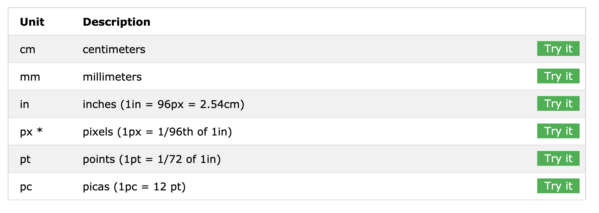
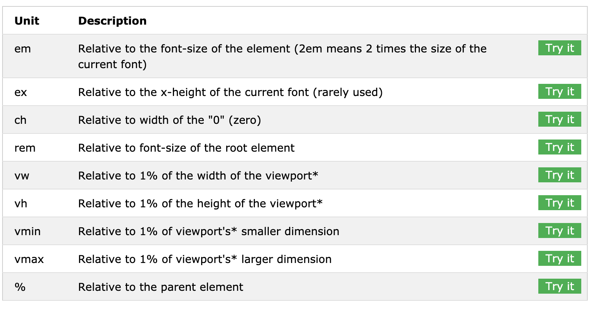

# CSS-1

### Linkovi:

- https://dev.to/devmount/8-games-to-learn-css-the-fun-way-4e0f
- https://www.cssbasics.com/
- http://scratchpad.io/fretful-elbow-653
- https://dev.to/emmabostian/css-specificity-1kca
- http://getbem.com/introduction/

## CSS
> Cascading Style Sheets (CSS) is a style sheet language used for describing the presentation of a document written in a markup language like HTML

## Ways of using

- Inline attribute
- tag
- css file

## Box-Model / (padding/margin)
>All HTML elements can be considered as boxes. In CSS, the term "box model" is used when talking about design and layout.

>The CSS box model is essentially a box that wraps around every HTML element. It consists of: margins, borders, padding, and the actual content.

### Margin
The CSS margin properties are used to create space around elements, outside of any defined borders.

### Padding
The CSS padding properties are used to generate space around an element's content, inside of any defined borders.

### Box-sizing
The box-sizing property defines how the width and height of an element are calculated: should they include padding and borders, or not.

## CSS Units (px/em/rem)

## Display
https://www.w3schools.com/cssref/pr_class_display.asp

## BEM
http://getbem.com/introduction/

## Selectors
https://developer.mozilla.org/en-US/docs/Web/CSS/CSS_Selectors

## Specificity

> CSS Specificity is the set of the rules applied to CSS selectors in order to determine which style is applied to an element. The more specific a CSS style is, the higher point value it accrues, and the likelier it is to be present on the element's style.
https://dev.to/emmabostian/css-specificity-1kca

## Extensions
  - Live server
  - Prettier
  - Syntax highlighters

## Shortcuts
  - Ctrl + Shift + L (F12) - Select all occurrences (ide super uz multi-cursor editing)
  - Shift + Alt + RightArrow/LeftArrow - Expand/shrink Select
  - Ctrl + Shift + [ / ] - Fold/unfold (collapse/uncollapse) region

## Vježba
- Zadatak preko sata (http://flukeout.github.io/) nakon selectora
- Vjezba za domaci na https://classroom.github.com/a/2zevo3oG