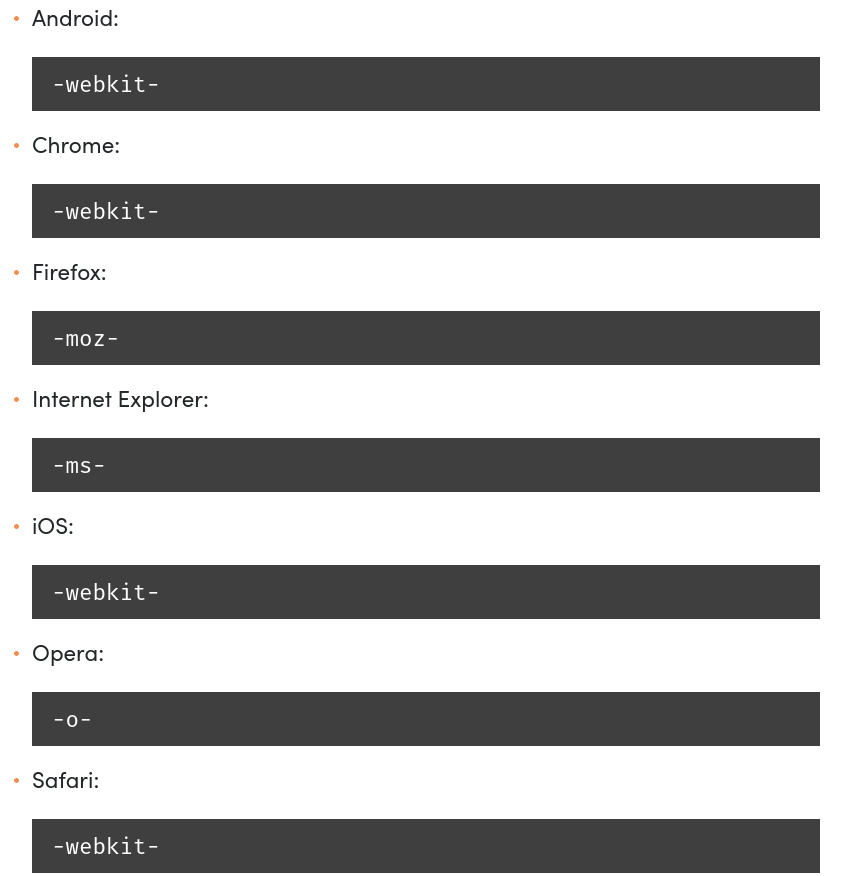

# CSS-2

### Linkovi:

- <a href="https://sass-lang.com/">SASS</a>
- <a href="https://developer.mozilla.org/en-US/docs/Glossary/Vendor_Prefix">Prefixes</a>

## SASS
> A CSS preprocessor is a program that lets you generate CSS from the preprocessor's own unique syntax.

> Stylesheets are getting larger, more complex, and harder to maintain. This is where a preprocessor can help. Sass lets you use features that don't exist in CSS yet like variables, nesting, mixins, inheritance and other nifty goodies that make writing CSS fun again.

## Media Queries
  <a href="https://www.w3schools.com/css/css_rwd_mediaqueries.asp">Responsive Media Queries</a>

## Mobile first

- <a href="https://medium.com/@Vincentxia77/what-is-mobile-first-design-why-its-important-how-to-make-it-7d3cf2e29d00">Mobile first</a>

## Prefix
> 

## Extensions
  - Prefixer
